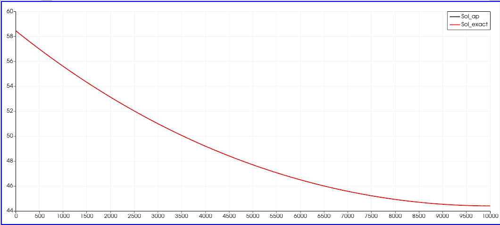
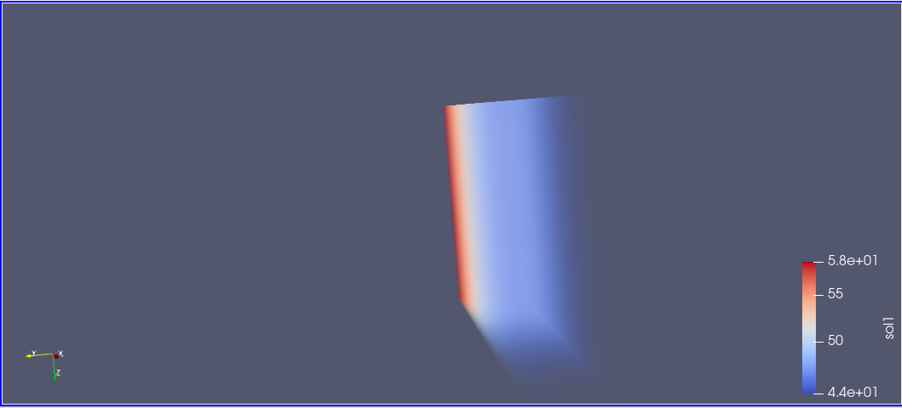

# M1-projects-simulation-numerique

Ce présent projet donne un survol partiel de mon étude consistant à simuler numériquement un dispositif en C++. J'ai développé un programme qui calcule les solutions de l'équation de la chaleur, laquelle modélise le dispositif de refroidissement en fonction du temps, ainsi que sans la variable temporelle, en utilisant la méthode des différences finies. Cette équation différentielle est donnée par la formule suivante :

$$
\rho Cp \frac{\partial T}{\partial t} - \kappa \frac{\partial^2 T}{\partial x^2} + \frac{hcp}{S} (T - Te) = 0
$$

Ce dispositif supplémentaire, représenté avec la figure ci-dessous, permet d’augmenter la surface d’échange avec le flux d’air et d’ainsi refroidir plus efficacement le composant électronique.

  

Ce travail est divisé en quatre parties :
Dans la première partie, nous présenterons un programme en C++ qui calcule le pas de temps et la matrice associée au problème. Ensuite, j'ai calculé les solutions en utilisant la méthode de décomposition LU. Nous examinerons également les erreurs entre la solution numérique et la solution exacte du modèle stationnaire.

  
  

  Erreur avec Lx = 40mm &nbsp;&nbsp;&nbsp;&nbsp;&nbsp;&nbsp; Erreur avec Lx = 80mm

- Dans la deuxième partie, nous examinerons les solutions en 3D et les visualiserons sur Paraview 

  
  

  
  

<b>Figure:</b> Résultats de la solution en 3D

	  	 		
	  	 		
- Dans la troisième partie, nous procédons de la même manière, mais cette fois pour le cas instationnaire en 1D. Nous examinerons également les erreurs entre la solution numérique et la solution exacte du modèle instationnaire.

  
  

  Flux de chaleur constant &nbsp;&nbsp;&nbsp;&nbsp;&nbsp;&nbsp; Avec activation/désactivation du flux de chaleur

        |

- Dans la quatrième partie, nous analyserons les solutions en 3D en fonction du temps et les visualiserons sur Paraview

  
  

  
  

<strong>Figure:</strong> Résultats de la solution en 3D

